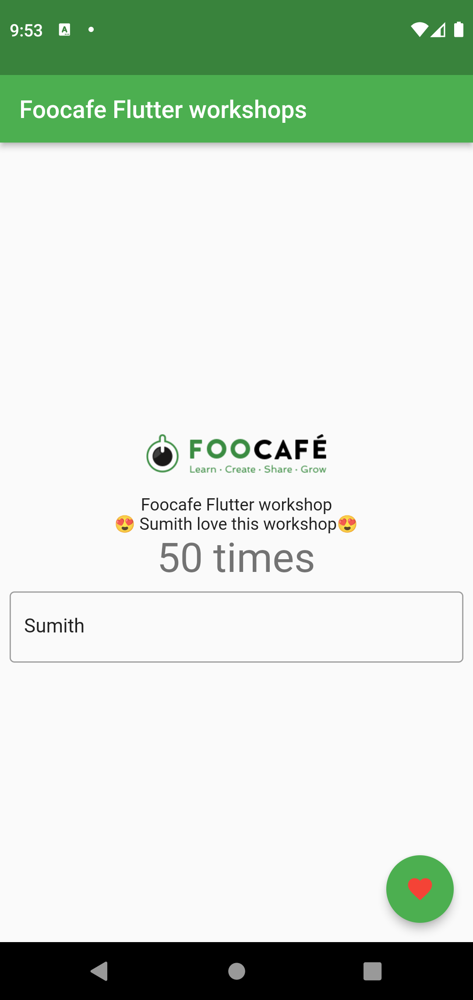

# flutterworkshop

Initial Code for Foocafe workshop

## Step 1 Starting Point

```powershell
flutter create flutterworkshop
cd flutterworkshop
flutter run
cd .\lib\
md helpers
md models
md providers
md screens
md services
md widgets
cd ..
code .
```

## Repo Code



